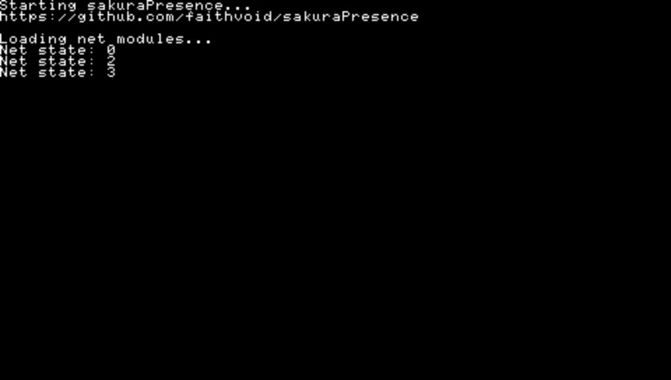
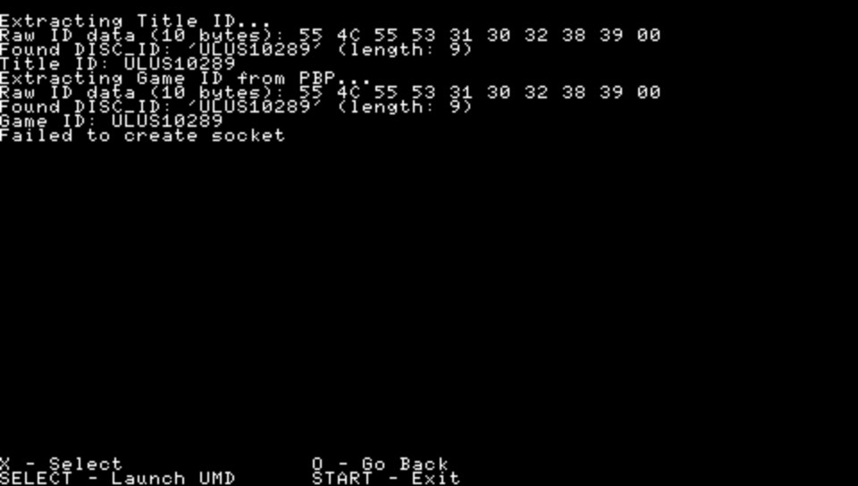

# sakuraPresencePSP
Discord Rich Presence proof of concept application for the Playstation Portable.

## Working:
- Fetching title ID from .PBP file
- Sending title ID from .PBP as a packet to a hardcoded IP address over network via the first available connection
- Launching .PBP (PPSSPP only)

## Not Working:
- Launching .PBP on real hardware (sceLoadExec only launches .PBPs when it has kernel access, which this application doesn't by default, but PPSSPP ignores that and launches PBPs anyway)
- UMD support (implemented but untested, doesn't seem to work in PPSSPP)
- ISO/CSO support

## Roadmap:
- [ ] Convert to plug-in that runs as both VSH and GAME module (can't get networking functions to work in plugin mode for some reason)
- [ ] Move server IP and port to .cfg file
